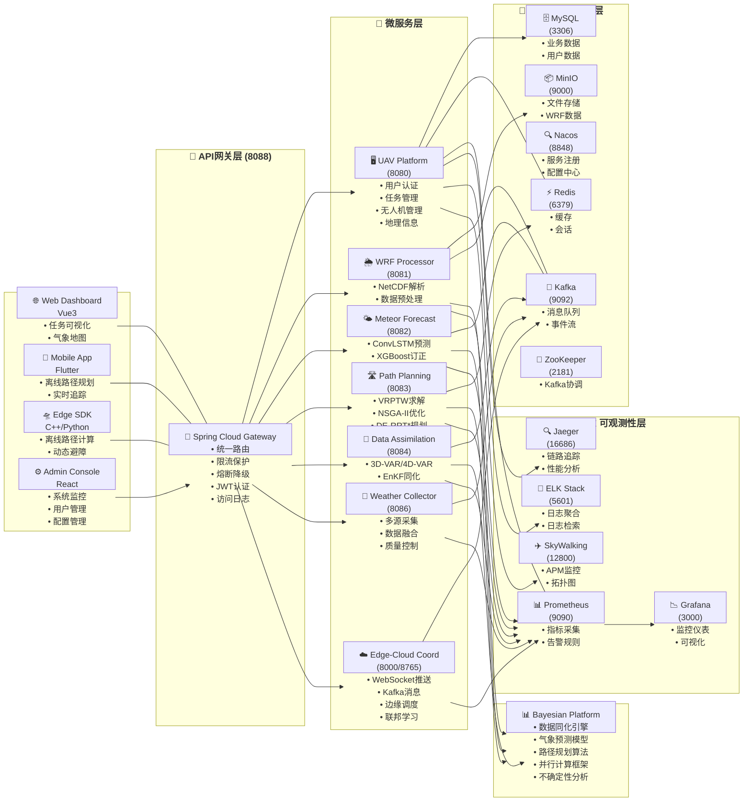

# 基于WRF气象驱动的无人机VRP智能路径规划系统

[](LICENSE)
[](https://openjdk.java.net/)
[](https://www.python.org/)
[](https://spring.io/projects/spring-boot) [](https://www.docker.com/)

## 目录

- [项目简介](#项目简介)
- [核心特性](#核心特性)
- [应用场景](#应用场景)
- [系统架构](#系统架构)
- [技术栈](#技术栈)
- [快速开始](#快速开始)
- [安装指南](#安装指南)
- [配置说明](#配置说明)
- [使用指南](#使用指南)
- [API文档](#api文档)
- [开发指南](#开发指南)
- [部署指南](#部署指南)
- [监控与运维](#监控与运维)
- [故障排除](#故障排除)
- [贡献指南](#贡献指南)
- [许可证](#许可证)
- [团队](#团队)

***

## 项目简介

本项目是一个面向城市低空物流、电力巡检、应急救援、农林植保、城市管理等场景的**全栈无人机智能调度系统**。系统集成了高精度气象预报、贝叶斯数据同化、多约束VRP路径规划、边云协同等核心技术，为无人机作业提供安全、高效、智能的路径规划服务。

### 设计理念

- **气象优先**：将WRF气象数据作为路径规划的核心约束条件
- **算法驱动**：采用3D-VAR/4D-VAR/EnKF多算法融合的数据同化技术
- **微服务架构**：基于Spring Cloud的分布式微服务架构
- **弹性可靠**：内置Resilience4j熔断器保障系统高可用
- **边云协同**：支持边缘端离线计算与云端智能决策协同

***

## 核心特性

### 🌤️ 气象数据处理

- **WRF模型解析**：支持NetCDF4格式的WRF气象数据解析
- **多源数据融合**：整合卫星、雷达、地面站、浮标等多源气象数据
- **5分钟级更新**：高频气象数据更新，实时响应气象变化
- **AI气象订正**：基于ConvLSTM+XGBoost的气象预测订正

### 🔬 数据同化

- **多算法支持**：3D-VAR、4D-VAR、EnKF、混合同化算法
- **GPU加速**：支持CUDA、JAX等GPU加速框架
- **分布式计算**：基于Dask/Ray/MPI的并行计算
- **不确定性分析**：贝叶斯不确定性量化与风险评估

### 🚁 路径规划

- **VRPTW算法**：带时间窗的车辆路径问题求解
- **三层规划架构**：
  - 全局规划：VRPTW + NSGA-II多目标优化
  - 局部规划：DE-RRT\* 动态路径调整
  - 动态避障：DWA动态窗口法
- **气象约束**：风速、降水、能见度等气象条件约束
- **动态重规划**：秒级响应气象突变自动调整路径

### 🏗️ 微服务架构

- **API网关**：统一入口、限流、熔断、路由
- **服务注册**：Nacos服务发现与配置中心
- **熔断器保护**：Resilience4j弹性机制
- **链路追踪**：集成Jaeger分布式追踪

### 📡 边云协同

- **边缘SDK**：C++/Python端侧离线路径规划
- **实时通信**：WebSocket/Kafka消息队列
- **联邦学习**：支持FedAvg联邦学习框架
- **模型压缩**：TensorRT/ONNX INT8量化加速

***

## 应用场景

| 场景         | 说明              |
| ---------- | --------------- |
| **城市低空物流** | 外卖快递配送，避开气象风险区域 |
| **电力巡检**   | 高压线路巡检，智能规划巡检路线 |
| **应急救援**   | 灾害现场物资投放，快速响应路径 |
| **农林植保**   | 农药喷洒，根据气象条件优化作业 |
| **城市管理**   | 交通监控、城市巡查，多任务调度 |

***

## 系统架构



### 架构说明

1. **📱 客户端层**：提供多种访问方式，包括Web管理端、移动端APP、边缘端SDK和运维控制台
2. **🚪 API网关层**：统一入口，提供路由、限流、熔断、认证等功能
3. **🔧 微服务层**：7个核心微服务，职责明确，通过Nacos注册发现
4. **💾 数据与基础设施层**：提供数据库、缓存、消息队列、对象存储等基础服务
5. **🧠 算法核心层**：Python实现的贝叶斯同化平台，提供气象数据处理和路径规划算法
6. **📈 可观测性层**：完整的监控、日志、追踪体系

---

**如果Mermaid无法渲染，请查看：**
- GitHub/GitLab需要开启Mermaid支持
- 或使用在线Mermaid编辑器：https://mermaid.live/
- 或查看项目其他文档中的架构图

***

## 技术栈

### 后端技术

| 技术               | 版本       | 用途        |
| ---------------- | -------- | --------- |
| **Java**         | 17+      | 主要开发语言    |
| **Spring Boot**  | 3.5.14    | 应用框架      |
| **Spring Cloud** | 2025.0.2 | 微服务框架     |
| **MyBatis-Plus** | 3.5.9    | ORM框架     |
| **Resilience4j** | 2.2.0    | 熔断与弹性机制   |
| **Nacos**        | 2.3.0    | 服务注册与配置中心 |
| **MySQL**        | 8.0+     | 关系型数据库    |
| **Redis**        | 6.2+     | 缓存/会话存储   |
| **Kafka**        | 7.4.0    | 消息队列      |

### 算法与AI

| 技术                     | 用途     |
| ---------------------- | ------ |
| **Python** 3.8+        | 算法开发语言 |
| **WRF Model**          | 气象数值预报 |
| **NetCDF4**            | 气象数据格式 |
| **NumPy/SciPy**        | 科学计算   |
| **Dask/Ray/MPI**       | 并行计算   |
| **PyTorch/TensorFlow** | 深度学习框架 |
| **ConvLSTM**           | 时序气象预测 |
| **XGBoost**            | 气象订正   |
| **CUDA/JAX**           | GPU加速  |

### 前端技术

| 技术                 | 版本   | 用途      |
| ------------------ | ---- | ------- |
| **Vue**            | 3.3+ | 前端框架    |
| **Vite**           | 4.0+ | 构建工具    |
| **Pinia**          | 最新   | 状态管理    |
| **Vue Router**     | 4.0  | 路由管理    |
| **Ant Design Vue** | 最新   | UI组件库   |
| **Leaflet**        | 最新   | 地图组件    |
| **ECharts**        | 最新   | 数据可视化   |
| **Cesium**         | 最新   | 3D地图/轨迹 |

### 边缘计算

| 技术               | 用途       |
| ---------------- | -------- |
| **C++**          | 高性能核心算法  |
| **pybind11**     | Python绑定 |
| **TensorRT**     | 模型推理加速   |
| **ONNX Runtime** | 跨平台推理    |
| **WebSocket**    | 实时通信     |

### DevOps

| 技术                 | 用途       |
| ------------------ | -------- |
| **Docker**         | 容器化      |
| **Docker Compose** | 本地编排     |
| **Kubernetes**     | 容器编排     |
| **Istio**          | 服务网格     |
| **Argo CD**        | GitOps部署 |
| **GitHub Actions** | CI/CD    |
| **Prometheus**     | 监控指标     |
| **Grafana**        | 监控仪表板    |
| **Jaeger**         | 链路追踪     |
| **ELK Stack**      | 日志聚合     |

***

## 快速开始

### 前置要求

- **Docker** 20.10+
- **Docker Compose** 2.0+
- **Git** 2.0+
- Java 17+
- Python 3.8+
- Node.js 16+

### 1. 克隆项目

```bash
git clone https://github.com/602420232-dotcom/weather.git
cd trae
```

### 2. 配置环境变量

```bash
# 复制环境变量模板
cp .env.example .env

# 编辑 .env 文件填入必要的配置
# 至少需要修改：
# - DB_PASSWORD: 数据库密码
# - JWT_SECRET_KEY: JWT密钥（至少32字符）
# - ENCRYPTION_KEY: 加密密钥（至少32字符）
```

生成安全密钥的方法：

```bash
# 使用 OpenSSL 生成随机密钥
openssl rand -base64 32
```

### 3. 启动服务

#### 使用 Docker Compose（推荐）

```bash
# 启动所有服务（首次会构建镜像，需要较长时间）
docker-compose up -d

# 查看服务状态
docker-compose ps

# 查看服务日志
docker-compose logs -f

# 查看特定服务日志
docker-compose logs -f uav-platform
```

#### 服务启动顺序

1. **基础设施**：MySQL → Redis → Nacos → Kafka/ZooKeeper
2. **微服务**：WRF Processor → Data Assimilation → Meteor Forecast → Path Planning → UAV Platform → Weather Collector → Edge-Cloud Coordinator
3. **网关**：API Gateway
4. **前端**（可选）：通过网关访问

### 4. 验证安装

访问以下地址验证服务是否正常启动：

| 服务             | URL                                     | 说明                      |
| -------------- | --------------------------------------- | ----------------------- |
| **API网关健康检查**  | <http://localhost:8088/actuator/health> | 检查网关状态                  |
| **Nacos控制台**   | <http://localhost:8848/nacos>           | 服务注册中心（默认账号nacos/nacos） |
| **前端应用**       | <http://localhost:3000>                 | Web管理界面                 |
| **Swagger UI** | <http://localhost:8080/swagger-ui.html> | API文档                   |

### 5. 快速测试

```bash
# 测试网关健康检查
curl http://localhost:8088/actuator/health

# 测试平台服务健康检查
curl http://localhost:8080/actuator/health
```

***

## 安装指南

### 环境要求

#### 硬件要求

**开发环境（最小）**：

- CPU: 4核
- 内存: 8GB RAM
- 磁盘: 20GB 可用空间

**生产环境（推荐）**：

- CPU: 8+ 核
- 内存: 16GB+ RAM
- 磁盘: 50GB+ SSD
- GPU: 可选（NVIDIA GPU 用于算法加速）

#### 操作系统支持

- ✅ Linux (Ubuntu 20.04+, CentOS 8+)
- ✅ macOS 11+
- ✅ Windows 10/11 (WSL2推荐)

### 安装方式

#### 方式一：Docker Compose 完整部署（推荐）

适用于快速体验和开发环境：

```bash
# 1. 克隆项目
git clone https://github.com/602420232-dotcom/weather.git
cd trae

# 2. 配置环境
cp .env.example .env
# 编辑 .env

# 3. 启动所有服务
docker-compose up -d

# 4. 等待服务启动（约2-5分钟）
docker-compose ps

# 5. 访问应用
# 前端: http://localhost:3000
# Nacos: http://localhost:8848/nacos
```

#### 方式二：Kubernetes 部署

适用于生产环境，详细步骤请参考[部署指南](docs/deployment/DEPLOYMENT.md)：

```bash
# 1. 创建命名空间
kubectl apply -f deployments/kubernetes/namespace.yml

# 2. 创建密钥
kubectl apply -f deployments/kubernetes/secrets.yml

# 3. 部署所有服务
kubectl apply -f deployments/kubernetes/

# 4. 检查部署状态
kubectl get pods -n uav-system
```

#### 方式三：本地开发模式

适用于需要修改代码的开发者。

**后端服务**：

```bash
# 1. 启动基础设施
docker-compose up -d mysql redis nacos kafka

# 2. 构建公共模块
cd common-utils
mvn clean install

# 3. 启动各个服务
cd ../uav-platform-service
mvn spring-boot:run
```

**前端应用**：

```bash
cd uav-path-planning-system/frontend-vue
npm install
npm run dev
```

**算法模块**：

```bash
cd data-assimilation-platform/algorithm_core
pip install -e .[dev]
python examples/basic_usage.py
```

***

## 配置说明

### 环境变量配置

项目使用 `.env` 文件进行环境配置。以下是关键配置项：

#### 安全配置

```env
# JWT密钥（必须修改，至少32字符）
JWT_SECRET_KEY=your-jwt-secret-key-here-min-32-chars

# 加密密钥（必须修改，至少32字符）
ENCRYPTION_KEY=your-encryption-key-here-min-32-chars
```

#### 数据库配置

```env
# MySQL数据库密码
DB_PASSWORD=your-secure-database-password
```

#### CORS配置

```env
# 允许的前端域名（逗号分隔）
CORS_ORIGINS=http://localhost:3000,http://localhost:8080
```

#### 服务间调用配置

```env
# 各服务内部访问地址
SERVICES_WRF_PROCESSOR_URL=http://wrf-processor:8081/api/wrf
SERVICES_DATA_ASSIMILATION_URL=http://data-assimilation:8084/api/assimilation
SERVICES_METEOR_FORECAST_URL=http://meteor-forecast:8082/api/forecast
SERVICES_PATH_PLANNING_URL=http://path-planning:8083/api/planning
```

#### Nacos配置

```env
# Nacos服务地址
NACOS_SERVER=nacos:8848
```

#### 限流配置

```env
# 每分钟请求数限制
RATE_LIMIT_REQUESTS_PER_MINUTE=100
RATE_LIMIT_ENABLED=true
```

### 熔断器配置

熔断器配置位于 `common-utils/src/main/resources/resilience4j-circuitbreaker.yml`：

```yaml
resilience4j:
  circuitbreaker:
    configs:
      default:
        register-health-indicator: true
        sliding-window-type: COUNT_BASED
        sliding-window-size: 100
        minimum-number-of-calls: 10
        permitted-number-of-calls-in-half-open-state: 3
        automatic-transition-from-open-to-half-open-enabled: true
        wait-duration-in-open-state: 10s
        failure-rate-threshold: 50
        event-consumer-buffer-size: 10
    instances:
      backendA:
        base-config: default
```

详细配置请参考[熔断器指南](docs/guides/CIRCUIT_BREAKER_GUIDE.md)。

***

## 使用指南

### 1. 用户认证

#### 登录

```bash
curl -X POST http://localhost:8080/api/v1/auth/login \
  -H "Content-Type: application/json" \
  -d '{
    "username": "admin",
    "password": "admin123"
  }'
```

**响应示例**：

```json
{
  "token": "eyJhbGciOiJIUzI1NiIsInR5cCI6IkpXVCJ9...",
  "user": {
    "id": 1,
    "username": "admin",
    "role": "ADMIN"
  }
}
```

#### 使用Token

后续请求需要在Header中携带Token：

```bash
curl http://localhost:8080/api/v1/drones \
  -H "Authorization: Bearer YOUR_TOKEN_HERE"
```

### 2. 无人机管理

#### 注册无人机

```bash
curl -X POST http://localhost:8080/api/v1/drones \
  -H "Authorization: Bearer YOUR_TOKEN" \
  -H "Content-Type: application/json" \
  -d '{
    "name": "Drone-001",
    "model": "DJI-M300",
    "maxPayload": 2.5,
    "maxFlightTime": 30,
    "maxSpeed": 15
  }'
```

#### 获取无人机列表

```bash
curl http://localhost:8080/api/v1/drones \
  -H "Authorization: Bearer YOUR_TOKEN"
```

### 3. 路径规划

#### 创建路径规划任务

```bash
curl -X POST http://localhost:8080/api/v1/tasks \
  -H "Authorization: Bearer YOUR_TOKEN" \
  -H "Content-Type: application/json" \
  -d '{
    "name": "物流配送任务",
    "type": "DELIVERY",
    "droneId": 1,
    "waypoints": [
      {"lat": 39.9042, "lng": 116.4074, "order": 1},
      {"lat": 39.9142, "lng": 116.4174, "order": 2},
      {"lat": 39.9242, "lng": 116.4274, "order": 3}
    ],
    "departureTime": "2026-05-09T10:00:00Z",
    "constraints": {
      "maxWindSpeed": 10,
      "minVisibility": 5000
    }
  }'
```

#### 获取规划结果

```bash
curl http://localhost:8080/api/v1/tasks/1/path \
  -H "Authorization: Bearer YOUR_TOKEN"
```

### 4. 气象数据

#### 上传WRF数据

```bash
curl -X POST http://localhost:8081/api/wrf/upload \
  -H "Authorization: Bearer YOUR_TOKEN" \
  -F "file=@wrfout_d01_2026-05-09_00_00_00.nc"
```

#### 获取气象预报

```bash
curl "http://localhost:8082/api/forecast?lat=39.9042&lng=116.4074&hours=24" \
  -H "Authorization: Bearer YOUR_TOKEN"
```

***

## API文档

### 在线文档

服务启动后可访问 Swagger UI：

| 服务                        | Swagger URL                             |
| ------------------------- | --------------------------------------- |
| UAV Platform Service      | <http://localhost:8080/swagger-ui.html> |
| WRF Processor Service     | <http://localhost:8081/swagger-ui.html> |
| Meteor Forecast Service   | <http://localhost:8082/swagger-ui.html> |
| Path Planning Service     | <http://localhost:8083/swagger-ui.html> |
| Data Assimilation Service | <http://localhost:8084/swagger-ui.html> |

### 详细API文档

详细的API文档请参考：

- [API总览](docs/api/README.md)
- [用户认证API](docs/api/uav-platform-service/auth.md)
- [无人机管理API](docs/api/uav-platform-service/drone.md)
- [任务管理API](docs/api/uav-platform-service/task.md)
- [路径规划API](docs/api/path-planning-service/path.md)
- [气象数据API](docs/api/meteor-forecast-service/forecast.md)
- [WRF处理API](docs/api/wrf-processor-service/wrf.md)
- [数据同化API](docs/api/data-assimilation-service/assimilation.md)

***

## 开发指南

### 项目结构

```
trae/
├── api-gateway/                    # API网关
├── common-utils/                   # 公共工具模块
├── uav-platform-service/           # 主平台服务
├── wrf-processor-service/          # WRF气象处理服务
├── meteor-forecast-service/        # 气象预测服务
├── path-planning-service/          # 路径规划服务
├── data-assimilation-service/      # 数据同化服务
├── uav-weather-collector/          # 气象数据采集服务
├── edge-cloud-coordinator/         # 边云协同服务
├── data-assimilation-platform/     # 贝叶斯同化平台(Python)
│   ├── algorithm_core/             # 核心算法库
│   ├── service_spring/             # Java服务封装
│   └── shared/protos/              # Protocol Buffers
├── uav-edge-sdk/                   # 边缘SDK
├── uav-path-planning-system/       # 路径规划系统(含前端)
│   └── frontend-vue/               # Vue3前端应用
├── deployments/                    # 部署配置
│   ├── kubernetes/                 # K8s配置
│   ├── monitoring/                 # 监控配置
│   └── service-mesh/               # Istio配置
├── docs/                           # 文档中心
├── tests/                          # 集成测试
├── scripts/                        # 工具脚本
├── docker-compose.yml              # Docker编排
├── .env.example                    # 环境变量模板
└── README.md                       # 本文档
```

详细项目结构请参考[项目结构指南](docs/PROJECT_STRUCTURE.md)。

### 开发环境设置

#### 1. 后端开发（Java）

**前置要求**：

- JDK 17+
- Maven 3.8+
- IDE（IntelliJ IDEA推荐 / Eclipse）

**设置步骤**：

```bash
# 1. 安装公共模块到本地Maven仓库
cd common-utils
mvn clean install

# 2. 导入项目到IDE
# 在IDEA中选择 "Open"，选择项目根目录的pom.xml

# 3. 配置IDE
# - 设置JDK 17
# - 配置Maven settings

# 4. 运行服务
# 在IDE中运行 *Application.java 主类
# 或使用命令行：
cd uav-platform-service
mvn spring-boot:run
```

#### 2. 前端开发（Vue3）

**前置要求**：

- Node.js 16+
- npm 8+ / pnpm 8+

**设置步骤**：

```bash
cd uav-path-planning-system/frontend-vue

# 安装依赖
npm install

# 启动开发服务器
npm run dev

# 构建生产版本
npm run build

# 代码检查
npm run lint
```

#### 3. 算法开发（Python）

**前置要求**：

- Python 3.8+
- pip / conda

**设置步骤**：

```bash
cd data-assimilation-platform/algorithm_core

# 创建虚拟环境
python -m venv venv
source venv/bin/activate    # Linux/macOS
# venv\Scripts\activate     # Windows

# 安装依赖（开发模式）
pip install -e .[dev]

# 运行测试
pytest

# 运行示例
python examples/basic_usage.py
```

### 代码规范

#### Java代码规范

项目使用Spotless进行代码格式化：

```bash
# 格式化代码
mvn spotless:apply

# 检查格式
mvn spotless:check
```

#### Python代码规范

项目使用Black和Flake8：

```bash
cd data-assimilation-platform/algorithm_core

# 格式化代码
black src/

# 代码检查
flake8 src/

# 类型检查
mypy src/
```

### 测试指南

#### 运行后端测试

```bash
# 运行所有测试
mvn test

# 运行特定模块测试
cd common-utils
mvn test

# 生成测试报告
mvn test jacoco:report
```

#### 运行算法测试

```bash
cd data-assimilation-platform/algorithm_core

# 运行单元测试
pytest tests/unit/

# 运行集成测试
pytest tests/integration/

# 生成覆盖率报告
pytest --cov=bayesian_assimilation --cov-report=html
```

***

## 部署指南

详细的部署指南请参考：

- [Docker部署指南](docs/DOCKER.md)
- [Kubernetes部署指南](docs/deployment/DEPLOYMENT.md)
- [生产环境部署清单](docs/deployment/DEPLOY_GUIDE.md)

### 生产环境检查清单

部署到生产环境前请确认：

- [ ] 所有密码和密钥已更新（不要使用默认值）
- [ ] TLS/SSL证书已配置
- [ ] 数据库已进行备份配置
- [ ] 监控告警已设置
- [ ] 日志聚合已配置
- [ ] 资源限制已设置
- [ ] 自动扩缩容已配置
- [ ] 灾备方案已制定
- [ ] 安全审计已启动

***

## 监控与运维

### 监控栈访问

部署监控服务后可访问：

| 服务               | URL                      | 默认账号        |
| ---------------- | ------------------------ | ----------- |
| **Grafana**      | <http://localhost:3000>  | admin/admin |
| **Prometheus**   | <http://localhost:9090>  | -           |
| **Jaeger**       | <http://localhost:16686> | -           |
| **Alertmanager** | <http://localhost:9093>  | -           |
| **Kibana**       | <http://localhost:5601>  | -           |

### 常用运维命令

```bash
# 查看服务状态
docker-compose ps

# 查看服务日志
docker-compose logs -f [service-name]

# 重启服务
docker-compose restart [service-name]

# 停止服务
docker-compose stop

# 停止并删除容器
docker-compose down

# 更新服务
docker-compose pull
docker-compose up -d

# 清理未使用的资源
docker system prune -a
```

### 健康检查API

所有服务都提供健康检查端点：

```bash
# 检查网关
curl http://localhost:8088/actuator/health

# 检查平台服务
curl http://localhost:8080/actuator/health

# 检查熔断器状态
curl http://localhost:8080/actuator/circuitbreakers
```

### 备份与恢复

#### 数据库备份

```bash
# 备份MySQL
docker-compose exec mysql mysqldump -u root -p uav_platform > backup.sql

# 恢复MySQL
docker-compose exec -T mysql mysql -u root -p uav_platform < backup.sql
```

#### 配置备份

```bash
# 备份Nacos配置
# 备份.env文件
cp .env .env.backup

# 备份Kubernetes配置
kubectl get configmap -n uav-system -o yaml > configmaps-backup.yaml
```

***

## 故障排除

### 常见问题

#### 1. 服务启动失败

**症状**：某个服务一直处于 restarting 状态。

**排查步骤**：

```bash
# 查看服务日志
docker-compose logs [service-name]

# 检查依赖服务是否正常
docker-compose ps

# 检查端口是否被占用
netstat -tulpn | grep [port]
```

**常见原因**：

- 数据库连接失败：检查 `DB_PASSWORD` 配置
- Nacos未启动：等待Nacos完全启动
- 端口被占用：修改端口或停止占用程序

#### 2. 前端无法连接后端

**症状**：前端显示网络错误。

**排查步骤**：

```bash
# 检查网关是否正常
curl http://localhost:8088/actuator/health

# 检查CORS配置
# 确认 .env 中的 CORS_ORIGINS 包含前端地址

# 检查浏览器控制台错误
# F12 打开开发者工具，查看 Network 标签
```

#### 3. 算法调用超时

**症状**：路径规划或数据同化请求超时。

**排查步骤**：

```bash
# 检查Python Executor日志
docker-compose logs uav-platform

# 检查资源使用
docker stats

# 增加超时配置
# 修改 .env 中的 UAV_PYTHON_TIMEOUT
```

### 获取帮助

如果遇到问题：

1. 查看 [故障排除指南](docs/guides/TROUBLESHOOTING.md)
2. 查看 [项目质量审计报告](docs/reports/COMPREHENSIVE_QUALITY_ASSESSMENT.md)
3. 提交 Issue 到 GitHub

***

## 贡献指南

我们欢迎任何形式的贡献！

### 贡献流程

1. **Fork 项目**
2. **创建特性分支** (`git checkout -b feature/AmazingFeature`)
3. **提交更改** (`git commit -m 'Add some AmazingFeature'`)
4. **推送到分支** (`git push origin feature/AmazingFeature`)
5. **创建 Pull Request**

### 代码贡献规范

- 遵循现有代码风格
- 添加必要的测试
- 更新相关文档
- 确保所有测试通过
- 提交信息清晰明了

### 开发路线图

查看 [更新日志](docs/UPGRADE_REPORT.md) 了解项目进展。

***

## 许可证

本项目采用 MIT 许可证。详见 [LICENSE](LICENSE) 文件。

***

## 团队

### 核心团队

- **成都大学无人机路径规划系统团队**

### 贡献者

感谢所有为本项目做出贡献的开发者！

***

## 致谢

- 感谢 WRF 模型团队提供的气象数值预报系统
- 感谢 Spring 社区提供的优秀微服务框架
- 感谢所有开源贡献者的努力

***

## 联系方式

- **项目地址**: <https://github.com/602420232-dotcom/weather>
- **文档中心**: [docs/README.md](docs/README.md)

***

> **最后更新**: 2026-05-10\
> **版本**: 2.2\
> **维护者**: DITHIOTHREITOL

