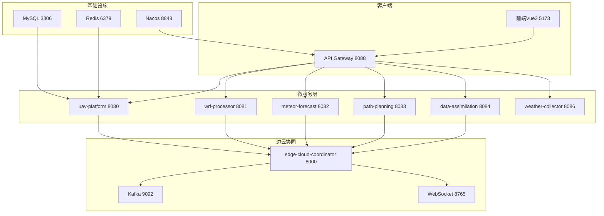

# 无人机路径规划系统 — 详细部署指南

## 环境要求

| 组件 | 版本要求 | 用途 |
|------|---------|------|
| Docker | 24.0+ | 容器运行环境 |
| Docker Compose | 2.20+ | 多容器编排 |
| Java | 17+ | 微服务运行 |
| Maven | 3.9+ | Java 构建 |
| Python | 3.11+ | 算法模块运行 |
| Node.js | 18+ | 前端构建 |
| Minikube/k3s | 1.28+（K8s部署） | 容器编排 |
| Helm | 3.12+（K8s部署） | K8s 包管理 |

## 架构总览



---

## 一、Docker Compose 部署（推荐）

### 第1步：克隆项目

```bash
git clone https://github.com/602420232-dotcom/weather uav-platform
cd uav-platform
```

### 第2步：配置环境变量

```bash
# 检查 .env.example 并复制
cp .env.example .env

# 编辑 .env 文件，按需修改
# DB_PASSWORD=your_secure_password
# JWT_SECRET=your_jwt_secret_32bytes
```

`.env` 文件关键配置：

| 变量 | 默认值 | 说明 |
|------|--------|------|
| `DB_PASSWORD` | `123456` | MySQL 数据库密码 |
| `NACOS_SERVER` | `nacos:8848` | Nacos 注册中心地址 |
| `REDIS_HOST` | `redis` | Redis 主机地址 |
| `REDIS_PORT` | `6379` | Redis 端口 |

### 第3步：启动基础设施

```bash
# 启动数据库、缓存、注册中心、消息队列
docker-compose up -d mysql redis nacos zookeeper kafka

# 等待基础设施就绪（约30秒）
docker-compose ps
```

验证：
```bash
# MySQL
docker exec uav-mysql mysqladmin ping -hlocalhost -u root -p${DB_PASSWORD:-123456}

# Redis
docker exec uav-redis redis-cli ping

# Nacos
curl -sf http://localhost:8848/nacos/actuator/health
```

### 第4步：构建并启动微服务

```bash
# 全部启动
docker-compose up -d --build

# 或逐个启动（便于观察日志）
docker-compose up -d --build api-gateway
docker-compose up -d --build wrf-processor
docker-compose up -d --build data-assimilation
docker-compose up -d --build meteor-forecast
docker-compose up -d --build path-planning
docker-compose up -d --build uav-platform
docker-compose up -d --build uav-weather-collector
```

### 第5步：验证所有服务

```bash
# 检查所有容器状态
docker-compose ps

# 逐个检查健康端点
for port in 8088 8080 8081 8082 8083 8084 8086; do
  echo "port $port: $(curl -sf http://localhost:$port/actuator/health | jq .status)"
done
```

预期输出：
```
port 8088: "UP"
port 8080: "UP"
port 8081: "UP"
port 8082: "UP"
port 8083: "UP"
port 8084: "UP"
port 8086: "UP"
```

### 第6步：查看日志

```bash
# 全部日志
docker-compose logs -f

# 单个服务日志
docker-compose logs -f uav-platform
docker-compose logs -f path-planning

# 最近100行
docker-compose logs --tail=100 -f api-gateway
```

### 第7步：停止服务

```bash
# 停止所有
docker-compose down

# 停止并删除数据卷
docker-compose down -v

# 停止单个
docker-compose stop path-planning
```

---

## 二、Maven 本地开发部署

### 第1步：构建根项目

```bash
# 在项目根目录执行（安装所有依赖）
mvn clean install -DskipTests -B

# 仅构建部分模块
mvn clean install -pl path-planning-service -am -DskipTests
```

### 第2步：启动基础设施

```bash
docker-compose up -d mysql redis nacos
```

### 第3步：逐个启动微服务

```bash
# 启动 WRF 处理服务
cd wrf-processor-service && mvn spring-boot:run

# 启动气象预测服务
cd meteor-forecast-service && mvn spring-boot:run

# 启动路径规划服务
cd path-planning-service && mvn spring-boot:run

# 启动贝叶斯同化服务
cd data-assimilation-service && mvn spring-boot:run

# 启动主平台服务
cd uav-platform-service && mvn spring-boot:run

# 启动气象收集服务
cd uav-weather-collector && mvn spring-boot:run

# 启动 API 网关
cd api-gateway && mvn spring-boot:run
```

### 第4步：启动边云协同框架

```bash
cd edge-cloud-coordinator
pip install -r requirements.txt
python -m uvicorn api:app --host 0.0.0.0 --port 8000 --reload
```

### 第5步：启动前端

```bash
cd uav-path-planning-system/frontend-vue
npm install
npm run dev
# 访问 http://localhost:5173
```

---

## 三、Python 算法模块独立部署

### WRF 处理器

```bash
cd wrf-processor-service/src/main/python
pip install -r requirements.txt
python wrf_processor.py <input.nc> [height]
```

### 气象预测

```bash
cd meteor-forecast-service/src/main/python
pip install -r requirements.txt
python meteor_forecast.py predict <input.json>
python meteor_forecast.py correct <forecast.json> <observed.json>
```

### 路径规划

```bash
cd path-planning-service/src/main/python
pip install -r requirements.txt
python three_layer_planner.py full <input.json>
```

### 贝叶斯同化

```bash
cd data-assimilation-platform
pip install -r requirements.txt
cd algorithm_core
pip install -e .
python -c "from bayesian_assimilation import BayesianAssimilator; print('OK')"
```

---

## 四、Kubernetes 部署

### 第1步：准备集群

```bash
# 使用 Minikube（本地测试）
minikube start --cpus 4 --memory 8g
minikube addons enable ingress

# 或使用 k3s
curl -sfL https://get.k3s.io | sh -
```

### 第2步：安装基础设施

```bash
# 创建命名空间
kubectl apply -f deployments/kubernetes/namespace.yml

# 部署数据库和缓存
kubectl apply -f deployments/kubernetes/database-services.yml

# 部署 Nacos
kubectl apply -f deployments/kubernetes/nacos.yml

# 部署 Prometheus + Grafana（可观测性）
kubectl apply -f deployments/observability/observability.yml
```

### 第3步：部署微服务

```bash
cd deployments/kubernetes

# 配置密钥
kubectl apply -f secrets.yaml

# 持久卷
kubectl apply -f persistent-volumes.yml

# 网关
kubectl apply -f api-gateway.yml

# 业务服务
kubectl apply -f wrf-processor.yml
kubectl apply -f meteor-forecast.yml
kubectl apply -f path-planning.yml
kubectl apply -f data-assimilation.yml
kubectl apply -f uav-platform.yml
kubectl apply -f uav-weather-collector.yml

# 前端
kubectl apply -f frontend-vue.yml

# Ingress
kubectl apply -f nginx-ingress.yml

# 自动伸缩
kubectl apply -f autoscaling.yml
```

### 第4步：验证

```bash
# 检查 Pod 状态
kubectl get pods -n uav-platform -w

# 检查 Service
kubectl get svc -n uav-platform

# 检查 Ingress
kubectl get ingress -n uav-platform

# 端口转发（本地访问）
kubectl port-forward -n uav-platform svc/uav-platform-service 8080:8080
```

### 第5步：GitOps（ArgoCD）

```bash
# 安装 ArgoCD
kubectl create namespace argocd
kubectl apply -n argocd -f https://raw.githubusercontent.com/argoproj/argo-cd/stable/manifests/install.yaml

# 部署 ArgoCD 应用
kubectl apply -f deployments/argo/argocd.yml
```

---

## 五、边缘设备部署

### ARM64（树莓派/Jetson）

```bash
cd deployments/edge-device
docker-compose -f docker-compose.edge.yml up -d --build
```

### x86 边缘节点

```bash
# 直接运行
cd edge-cloud-coordinator
pip install -r requirements.txt
python -m uvicorn api:app --host 0.0.0.0 --port 8000

# 或使用 Docker
docker build -t uav-edge:latest .
docker run -d --name uav-edge \
  -p 8000:8000 -p 8765:8765 \
  -v edge-models:/app/models \
  -e EDGE_NODE_ID=edge-001 \
  uav-edge:latest
```

---

## 六、服务网格（Istio）

```bash
# 安装 Istio
istioctl install -f deployments/service-mesh/istio.yml -y

# 部署治理配置
kubectl apply -f deployments/service-mesh/governance.yml

# 启用 mTLS
kubectl apply -f deployments/service-mesh/mtls.yml

# 查看流量
istioctl proxy-status
kubectl logs -l app=istio-ingressgateway -n istio-system
```

---

## 七、监控与可观测性

### 访问地址

| 组件 | URL | 说明 |
|------|-----|------|
| Prometheus | http://localhost:9090 | 指标采集 |
| Grafana | http://localhost:3000 (admin/admin) | 仪表盘 |
| Jaeger UI | http://localhost:16686 | 链路追踪 |
| Kafka UI | http://localhost:8087 | 消息队列监控 |

### 预置告警规则

```yaml
# 服务离线
- alert: ServiceDown
  expr: up == 0
  for: 1m

# 内存超限
- alert: HighMemoryUsage
  expr: jvm_memory_used_bytes / jvm_memory_max_bytes > 0.85
  for: 2m
```

---

## 八、故障排查

### 服务启动失败

```bash
# 查看详细日志
docker-compose logs <service-name>
journalctl -u docker.service

# 检查端口占用
netstat -tlnp | grep 8080

# 检查 Docker 资源
docker system df
```

### API 调用失败

```bash
# 检查 Nacos 服务注册
curl http://localhost:8848/nacos/v1/ns/instance/list?serviceName=uav-platform-service

# 检查网关路由
curl -sf http://localhost:8088/actuator/gateway/routes | jq .

# 测试直接调用
curl -sf http://localhost:8080/actuator/health
```

### 数据库连接失败

```bash
# 测试 MySQL 连接
docker exec -it uav-mysql mysql -u root -p${DB_PASSWORD} -e "SELECT 1"

# 检查连接池
curl -sf http://localhost:8080/actuator/health | jq .components.db
```

---

## 九、备份与恢复

```bash
# 数据库备份
docker exec uav-mysql mysqldump -u root -p${DB_PASSWORD} --all-databases > backup_$(date +%Y%m%d).sql

# 数据库恢复
cat backup.sql | docker exec -i uav-mysql mysql -u root -p${DB_PASSWORD}

# 配置文件备份
tar czf config_backup_$(date +%Y%m%d).tar.gz \
  */src/main/resources/*.yml \
  *.yml *.yaml
```

---

## 十、性能调优

### JVM 参数

```bash
# 生产环境推荐 JVM 参数
JAVA_OPTS="-Xms512m -Xmx1g -XX:+UseG1GC -XX:MaxGCPauseMillis=200"
```

### Docker 资源限制

```yaml
# docker-compose.yml 示例
services:
  path-planning:
    deploy:
      resources:
        limits: { memory: 1G, cpus: '2' }
        reservations: { memory: 512M, cpus: '1' }
```

### 连接池

```yaml
# application.yml
spring:
  datasource:
    hikari:
      maximum-pool-size: 20
      minimum-idle: 5
      connection-timeout: 5000
```

---

## 部署检查清单

### 部署前
- [ ] 检查 Docker 和 Docker Compose 版本
- [ ] 检查系统资源（CPU ≥ 4核，内存 ≥ 8G，磁盘 ≥ 50G）
- [ ] 配置 `.env` 环境变量（数据库密码、JWT密钥）
- [ ] 确保网络可访问 Docker Hub / Maven Central
- [ ] 确保 MySQL 和 Redis 端口未被占用
- [ ] 检查 Java 17+ 和 Maven 3.9+ 安装
- [ ] 检查 Python 3.11+ 和 pip 安装

### 部署中
- [ ] 基础设施启动成功（MySQL/Redis/Nacos/Kafka）
- [ ] 所有微服务注册到 Nacos
- [ ] API 网关路由可用
- [ ] 前端可访问
- [ ] 边云协调器 WebSocket 连接正常

### 部署后
- [ ] 全部健康检查端点返回 `UP`
- [ ] 端到端路径规划测试通过
- [ ] Prometheus 指标采集正常
- [ ] Grafana 仪表盘数据展示
- [ ] Jaeger 链路追踪采样正常
- [ ] 数据库备份策略已配置
---

> **最后更新**: 2026-05-08  
> **版本**: 2.1  
> **维护者**: DITHIOTHREITOL
